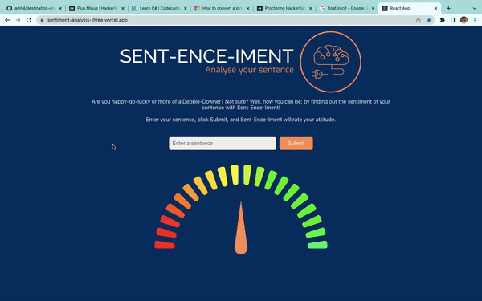

# Sent-ence-iment

A natural language processing app that can gauge the positivity/negativity of a phrase provided by the user.

The frontend is built using Javascript and React, which is deployed on Vercel. With the backend being built in Python and Flask, which is deployed on Render.

## Planning

The programme started as a high level idea where we wanted to use Natural Language Processing to analyse user input.

After our initial research there were a few primary hurdles we had to overcome such as learning Python and test driving Python, integrating a JS frontend and Python Backend and from a users perspective how to we display the mathmatical output in an easy to understand format.
