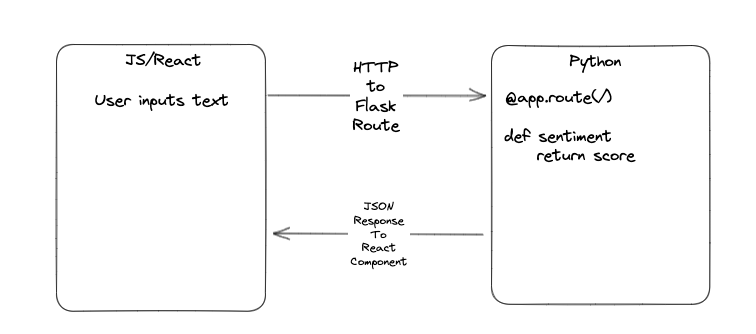
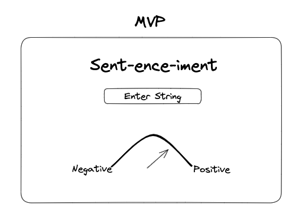

# Sent-ence-iment

A natural language processing app that can gauge the positivity/negativity of a phrase provided by the user.

The frontend is built using Javascript and React, which is deployed on Vercel. With the backend being built in Python and Flask, which is deployed on Render.


## Planning

The programme started as a high level idea where we wanted to use Natural Language Processing to analyse user input.

After our initial research there were a few primary hurdles we had to overcome such as learning Python and test driving Python, integrating a JS frontend and Python Backend and from a users perspective how to we display the mathmatical output in an easy to understand format.

## Technologies Research

After spending sometime to investigate the hurdles listed above we settled on using Python and its Natural Language Tool Kit (NLTK) library. This would be built as a Flask app allowing us to send HTTP requests from our Javascript frontend, allowing us to combine the two languages.

For the frontend we settled on Javascript and React. This allowed us to overcome the hurdle of displaying the output to the user by using a module called GaugeChart.

To help understand our research we diagrammed out the process to visualise how the technologies would integrate together.



## Our MVP

Working with an Agile methodology it was crucial to keep our MVP light so we could quickly integrate tickets and iterate on our product as it developed.

To help create our MVP we wrote out our User Stories and then converted these into a wireframe.

```
As a user
I want to
Input a sentence

As a user
I want to
View a sentiment score for my sentence
```



## Sprint Planning

After understanding the features we would need we then broke these down further into smaller tickets to create our first sprint, initally focusing on creating our Python backend via TDD.

For our second sprint we repeated the same process to TDD our JS frontend.

## Features

- The user can input a string.
- The mathmatical sentiment score is represented visually on our Sentiment Gauge.

## Frontend Testing
